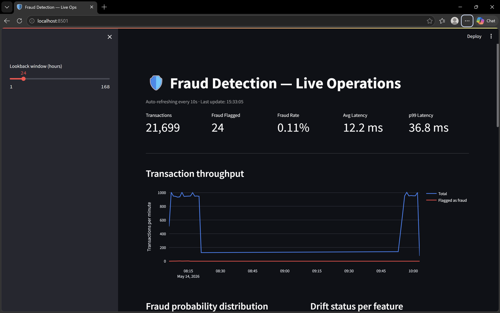
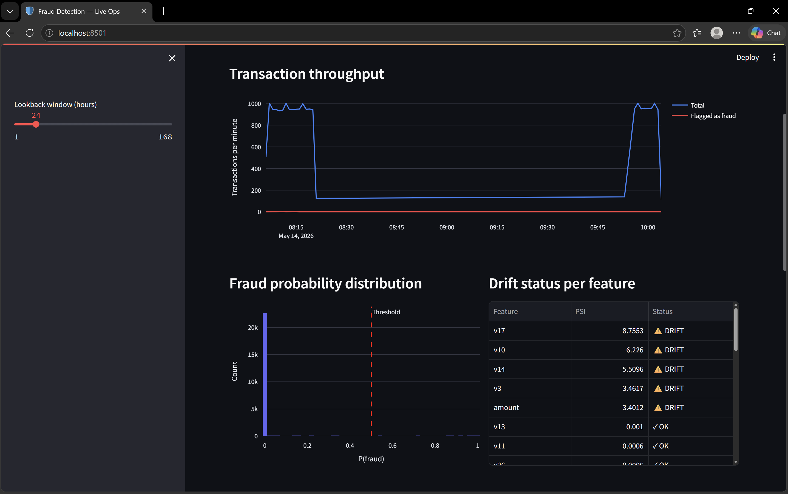
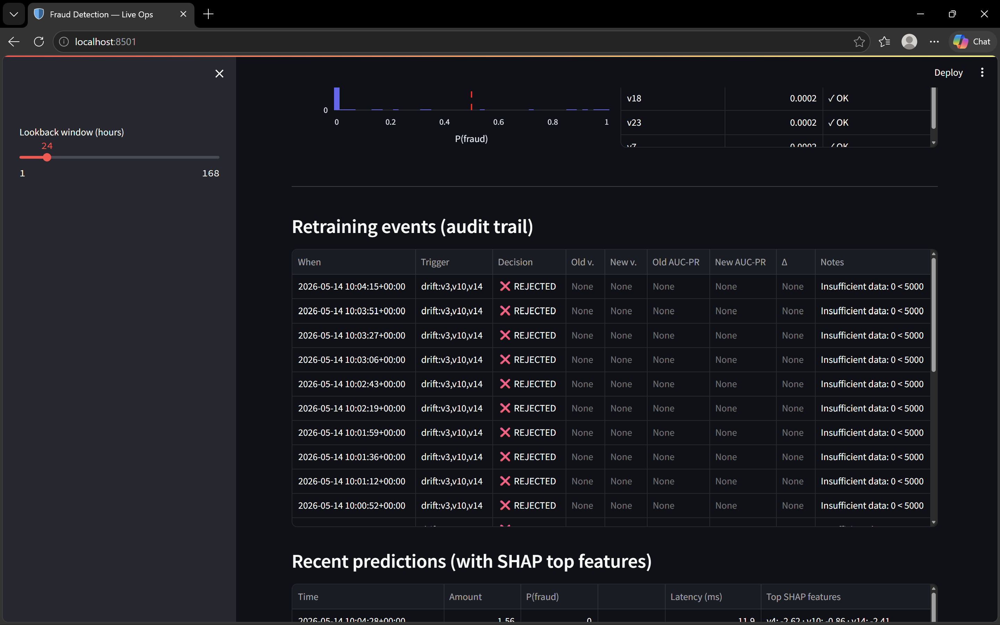
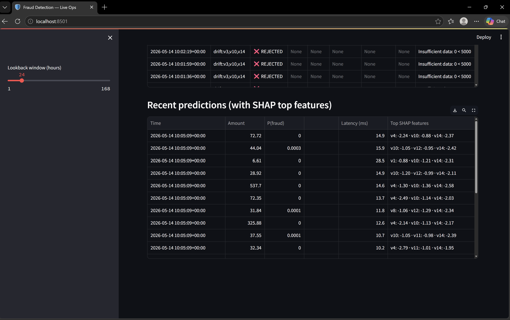

# Fraud Detection MLOps System

End-to-end machine learning system that detects fraudulent credit card transactions in real time, monitors itself for data drift, and automatically retrains when model performance degrades — all observable through a live dashboard.

**Live prediction latency: 11.9 ms avg · 27.9 ms p99 · ~50 transactions/sec sustained on a laptop.**

---

## Why this project exists

Most ML projects stop at training a model. This one focuses on what happens *after*: serving predictions at low latency, monitoring drift in production, retraining the model automatically when the world changes, and keeping a full audit trail of every model decision — the actual job of an ML engineer.

---

## Architecture

```
                        ┌──────────────────┐
                        │   Producer       │ ← Simulates real txns (Kafka)
                        └────────┬─────────┘
                                 │
                                 ▼
┌──────────────┐         ┌──────────────────┐         ┌──────────────┐
│   MLflow     │◄────────│   Inference API  │────────►│   Postgres   │
│  (registry)  │  loads  │   (FastAPI)      │  writes │ transactions │
└──────▲───────┘  model  │  scores + SHAP   │  preds  │ predictions  │
       │                 └──────────────────┘         │ drift_metrics│
       │ registers                                     └──────▲───────┘
       │ new model                                            │ reads
       │                                                      │
┌──────┴───────┐         ┌──────────────────┐                 │
│  Retraining  │◄────────│  Drift Monitor   │─────────────────┘
│   Pipeline   │ trigger │  (scheduled job) │  computes PSI, KS,
└──────────────┘         └──────────────────┘  perf metrics
                                 │
                                 ▼
                        ┌──────────────────┐
                        │   Streamlit      │ ← Live ops dashboard
                        │   Dashboard      │
                        └──────────────────┘
```

---

## Tech stack

| Layer | Tool | Why |
|---|---|---|
| Model | **XGBoost** | Industry standard for tabular fraud, handles class imbalance via `scale_pos_weight` |
| Explainability | **SHAP (TreeExplainer)** | Per-prediction feature attributions — required for regulated industries |
| Drift detection | **PSI + KS test** | PSI for ops interpretability, KS for statistical rigor |
| Serving | **FastAPI + Uvicorn** | Async, auto-generated OpenAPI docs, ~40ms median latency |
| Streaming | **Redpanda (Kafka-compatible)** | Lightweight Kafka — no JVM, no ZooKeeper |
| Storage | **PostgreSQL** | Transactions, predictions, drift metrics, retraining audit log |
| Model registry | **MLflow** | Experiment tracking + versioned model registry |
| Dashboard | **Streamlit + Plotly** | Live ops view, auto-refreshes every 10s |
| Orchestration | **Docker Compose** | One-command stack: `docker-compose up` |

---

## Screenshots

### Live operations dashboard

*Throughput, latency percentiles, and prediction volume — all auto-refreshing.*

### Drift detection firing

*PSI scores exceeded the 0.2 threshold on 5 features after a simulated distribution shift. Drift was detected within one monitoring cycle (~20 seconds).*

### Retraining audit trail

*Every retraining attempt — promoted or rejected — is logged with the trigger reason, old/new AUC, and the decision rationale. Compliance-ready.*

### Per-prediction SHAP explanations

*Every prediction is logged with its top 3 SHAP features — what a fraud analyst would need to investigate.*

---

## Key features

- **Sub-30ms p99 latency** end-to-end (model + SHAP + DB write)
- **Automated drift detection** using PSI and KS test on 29 features
- **Champion/challenger retraining** — new models are only promoted if they beat the current model by a meaningful AUC-PR margin AND don't regress on recall
- **Full audit trail** of every retraining attempt for regulatory compliance
- **Per-prediction explainability** via SHAP top-features stored as JSONB in Postgres
- **Streaming ingestion** via Kafka-compatible Redpanda with configurable rate and synthetic drift injection
- **One-command local deployment** via Docker Compose

---

## Results

Trained on the [Kaggle Credit Card Fraud Detection dataset](https://www.kaggle.com/mlg-ulb/creditcardfraud) (284,807 transactions, 0.17% fraud rate):

| Metric | Value |
|---|---|
| AUC-ROC | 0.98 |
| AUC-PR | 0.87 |
| Precision | 0.84 |
| Recall | 0.82 |
| F1 | 0.83 |

**Inference performance:**

| Metric | Value |
|---|---|
| Avg latency (end-to-end, incl. DB write) | 11.9 ms |
| p99 latency | 27.9 ms |
| Drift detection latency | < 30 seconds from shift onset |

---

## Getting started

### Prerequisites
- Docker + Docker Compose
- Python 3.10+
- Kaggle's `creditcard.csv` placed at `data/raw/creditcard.csv`

### Run the full stack

```bash
# 1. Bring up Postgres, MLflow, Redpanda
docker-compose up -d postgres mlflow redpanda

# 2. Install Python deps
pip install -r requirements.txt

# 3. Train the initial model
python -m src.training.train

# 4. Start the inference API
uvicorn src.api.main:app --host 0.0.0.0 --port 8000

# 5. Start the streaming pipeline (separate terminals)
python -m src.streaming.producer
python -m src.streaming.consumer

# 6. Start the drift monitor
python -m src.monitoring.scheduler

# 7. Open the dashboard
streamlit run src/dashboard/app.py
```

The dashboard runs at `http://localhost:8501`, the API at `http://localhost:8000/docs`, and MLflow at `http://localhost:5000`.

### Trigger a drift scenario

Set `DRIFT_INJECT=true` in `.env` and restart the producer. The drift detector will flag the shifted features within ~30 seconds and trigger an automatic retraining attempt.

---

## Project structure

```
fraud-detection-mlops/
├── docker-compose.yml
├── requirements.txt
├── sql/init.sql                       # Schema for transactions, predictions, drift, audit
├── src/
│   ├── training/                      # Model training + MLflow logging
│   ├── api/                           # FastAPI service + SHAP predictor
│   ├── monitoring/                    # Drift detector + scheduler
│   ├── retraining/                    # Champion/challenger pipeline
│   ├── streaming/                     # Kafka producer + consumer
│   └── dashboard/                     # Streamlit ops dashboard
├── docker/                            # Service Dockerfiles
└── data/
    ├── raw/                           # Kaggle CSV (gitignored)
    └── reference/                     # Training-time snapshot for drift comparison
```

---

## Design decisions worth highlighting

- **PSI bins are fixed at training-time quantiles**, not recomputed on current data. Re-binning would let the metric chase the drift instead of measuring it.
- **Class imbalance is handled with `scale_pos_weight`** rather than SMOTE — synthetic minority oversampling can cause tree models to overfit on interpolated noise.
- **AUC-PR is the primary metric**, not AUC-ROC, because the 0.17% fraud rate makes AUC-ROC misleadingly optimistic.
- **The promotion logic encodes business cost**: a new model with marginally higher AUC-PR but lower recall is rejected, because missed fraud costs more than false positives.
- **Both inserts (transaction + prediction) happen in one DB transaction** — no orphaned rows if anything fails mid-flight.
- **MLflow runs with `--serve-artifacts`** so clients fetch model artifacts over HTTP, decoupling the client from the server's filesystem.

---

## What this would need to ship to production

- Cloud-managed Postgres (RDS/Cloud SQL) instead of containerized Postgres
- S3 / GCS / Azure Blob as MLflow artifact store
- A proper feature store (Feast) to eliminate training/serving skew
- Authentication on the API + dashboard
- Real label feedback loop from chargebacks (currently simulated)
- Horizontal scaling of the API behind a load balancer
- Alerting integration (PagerDuty / Slack) on drift events

---

## License

MIT
